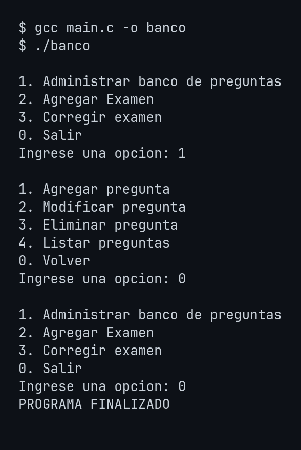
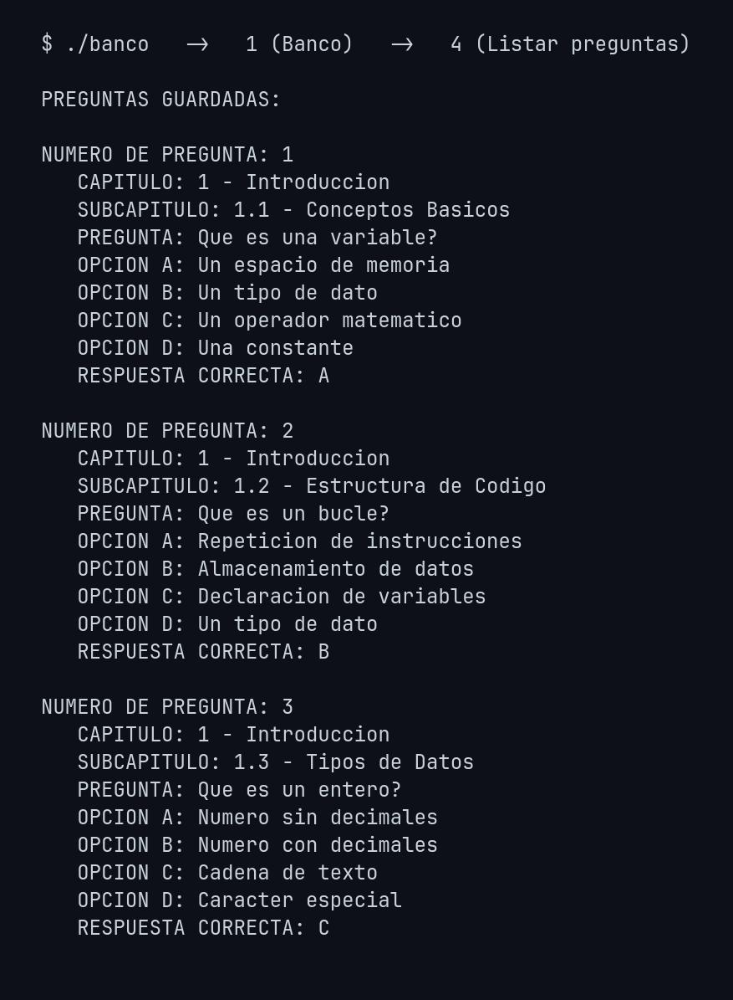

# Question Bank & Exams (C)

> 🇬🇧 English version below · 🇪🇸 [Versión en español](#banco-de-preguntas-y-exámenes-c)

Console application written in **C** to manage a question bank, generate exams from it and
grade them. Built as the final project for the **Structured Languages** course.

## Features

- **Question bank**: add, edit, delete and list questions.
- **Exams**: create exams by selecting questions from the bank, and list them.
- **Grading**: grade completed exams.
- Persistence in text files (`preguntas.txt`, `examenes.txt`).

## Design

**Modular** code: each operation lives in its own `.c` file, coordinated by menus
(`main.c` → `menuBanco.c` / `menuExamen.c` / `menuCorreccion.c`). Shared structures and
constants are in the headers `datosComunes.h` and `definiciones.h`.

```
main.c              # main menu
menuBanco.c         # questions CRUD
menuExamen.c        # exam creation
menuCorreccion.c    # exam grading
agregarPregunta.c modificarPregunta.c eliminarPregunta.c listarPreguntas.c
crearExamen.c listarExamenes.c
datosComunes.h definiciones.h
preguntas.txt examenes.txt   # sample data
```

## Demo

**Menu navigation** · **List questions**




## Build & run

`main.c` includes the other modules via `#include`, so a single file is compiled:

```bash
gcc main.c -o banco
./banco
```

> The code uses `system("cls")` (clear screen on Windows). On Linux/Mac replace it with
> `system("clear")` for the same behavior.

> Note: source code and comments are in Spanish.

---

# Banco de Preguntas y Exámenes (C)

> 🇪🇸 Versión en español · 🇬🇧 [English version above](#question-bank--exams-c)

Aplicación de consola en **C** para administrar un banco de preguntas, generar
exámenes a partir de él y corregirlos. Desarrollada como trabajo final de la materia
**Lenguajes Estructurados**.

## Funcionalidades

- **Banco de preguntas**: agregar, modificar, eliminar y listar preguntas.
- **Exámenes**: crear exámenes seleccionando preguntas del banco y listarlos.
- **Corrección**: corregir exámenes rendidos.
- Persistencia en archivos de texto (`preguntas.txt`, `examenes.txt`).

## Diseño

Código **modular**: cada operación vive en su propio archivo `.c`, coordinados por
menús (`main.c` → `menuBanco.c` / `menuExamen.c` / `menuCorreccion.c`). Las estructuras
y constantes compartidas están en los headers `datosComunes.h` y `definiciones.h`.

```
main.c              # menú principal
menuBanco.c         # ABM de preguntas
menuExamen.c        # creación de exámenes
menuCorreccion.c    # corrección de exámenes
agregarPregunta.c modificarPregunta.c eliminarPregunta.c listarPreguntas.c
crearExamen.c listarExamenes.c
datosComunes.h definiciones.h
preguntas.txt examenes.txt   # datos de ejemplo
```

## Demo

**Navegación de menús** · **Listado de preguntas**


## Compilar y ejecutar

`main.c` incluye los demás módulos vía `#include`, así que se compila un único archivo:

```bash
gcc main.c -o banco
./banco
```

> El código usa `system("cls")` (limpiar pantalla en Windows). En Linux/Mac
> reemplazar por `system("clear")` si se desea el mismo comportamiento.

## Autor / Author

Manuel González Janin
